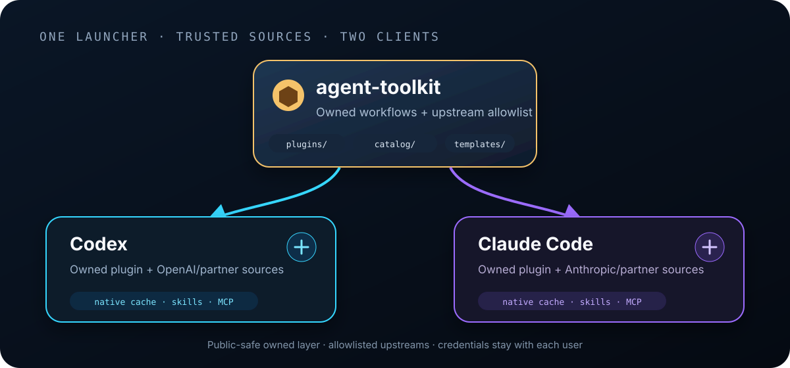

<div align="center">
  
  <h1>Agent Toolkit</h1>
  <p><strong>One command. One shared setup. Codex and Claude Code.</strong></p>
  <p>Install a polished, public-safe agent stack without copying credentials, private memories, personal paths, or private project rules.</p>
  <p>
    <a href="#install"><strong>Install</strong></a>
    · <a href="#what-you-get">What you get</a>
    · <a href="docs/UPSTREAMS.md">Source ledger</a>
    · <a href="docs/TROUBLESHOOTING.md">Help</a>
  </p>
  <p>
    <a href="https://github.com/udhawan97/agent-toolkit/actions/workflows/validate.yml"></a>
    
    
    <a href="LICENSE"></a>
  </p>
</div>

## Install

### macOS or Linux

```bash
curl -fsSL https://raw.githubusercontent.com/udhawan97/agent-toolkit/stable/bin/setup | sh
```

### Windows PowerShell

```powershell
irm https://raw.githubusercontent.com/udhawan97/agent-toolkit/stable/bin/setup.ps1 | iex
```

> [!NOTE]
> The full native install/update/doctor/uninstall journey is validated on macOS. Linux and Windows run repository and launcher checks in CI; their complete native-client lifecycle is still pending validation.

That is the complete setup. It detects Codex and/or Claude Code, installs the matching packages, merges a sanitized working agreement, and writes local receipts for later checks.

> [!IMPORTANT]
> Nothing runs when you clone or download this repository. Setup starts only when you run it. The default profile fetches allowlisted packages from their original providers; review the readable [source ledger](docs/UPSTREAMS.md) first if you prefer.

<details>
<summary><strong>Prerequisites</strong></summary>

- Git
- Python 3.10+
- Codex CLI, Claude Code, or both
- [`uv`](https://docs.astral.sh/uv/) for Graphify’s isolated Python tool install
- Node.js with `npx` for Matt Pocock’s cross-agent skills installer

Setup checks these before changing client state. Provider logins remain separate and happen only when a provider plugin actually needs them.

</details>

<details>
<summary><strong>Inspect before running</strong></summary>

```bash
git clone --branch stable --depth 1 https://github.com/udhawan97/agent-toolkit.git
cd agent-toolkit
python bin/agent-kit validate
python bin/agent-kit install --dry-run
python bin/agent-kit install
```

A downloaded [stable ZIP](https://github.com/udhawan97/agent-toolkit/archive/refs/heads/stable.zip) is a manual-update installation. Extract it to a stable location and run `python bin/agent-kit install --source local`.

</details>


## What you get

```text
Your command
   │
   ├── Toolkit-owned workflows ── evidence audits + council review
   ├── Trusted upstream skills ── Graphify + Matt Pocock + visual/code tools
   ├── Provider essentials ────── official OpenAI + Anthropic marketplaces
   ├── Local browser tool ─────── verified Obscura payload + exact MCP registration
   └── Shared guidance ────────── sanitized CLAUDE.md + AGENTS.md blocks
```

### Toolkit-owned workflows

These are the only skills copied from this repository:

| Skill | Use it for |
| --- | --- |
| `tech-debt` | Trace architecture or stack debt to a real user consequence. |
| `improve-userflow-design` | Audit complete journeys and improve only selected gaps. |
| `council-review` | Challenge material findings through a two-round evidence gate. |

### Trusted upstream stack

Outside packages are installed from their original repositories or official marketplaces. They are not silently republished here.

| Layer | Included by the default profile |
| --- | --- |
| Codebase understanding | Graphify and Understand Anything |
| Planning and delivery | 37 Matt Pocock skills from a reviewed commit, installed for both clients |
| Design communication | Diagram Design |
| Simpler implementation | Ponytail |
| Browser work | Obscura MCP, with archive, executable, worker, and registration checks |
| Codex provider essentials | OpenAI app-building, visualization, security, and developer plugins; setup handles Codex's reserved official catalog automatically |
| Claude provider essentials | Anthropic-authored setup, review, simplification, feature, design, security, and skill-authoring workflows, plus clearly attributed Playwright and Superpowers partner packages |

See every repository, license, package, and update policy in the [upstream source ledger](docs/UPSTREAMS.md).

### Sanitized shared guidance

Setup merges one marked block into each detected client. It is modeled on a real working setup but contains no name, email, home path, account identifier, private memory, or project-specific rule.

- [Claude Code template](templates/claude/CLAUDE.md)
- [Codex template](templates/codex/AGENTS.md)

The block covers concise communication, authority boundaries, browser routing, Superpowers/Ponytail precedence, and Graphify-first codebase navigation. Existing files are preserved and backed up. Use `--no-guidance` to skip it.

## Pick a profile

| Profile | Best for | Installs |
| --- | --- | --- |
| `recommended` | Most people | The complete public-safe stack shown above |
| `skills-only` | No provider plugins or MCP | Owned workflows, Graphify, and Matt Pocock’s skills |
| `full` | Automation that wants an explicit “everything” name | Same complete allowlist as `recommended` |
| `--core-only` | Minimal or offline review | Only the three toolkit-owned workflows |

Examples:

```bash
python bin/agent-kit install --clients codex
python bin/agent-kit install --clients claude --profile skills-only
python bin/agent-kit install --clients both --core-only --no-guidance
```

## Try it

Restart active client sessions after setup.

**Codex**

```text
Use $tech-debt to audit how this stack affects the checkout journey. Audit only.
```

**Claude Code**

```text
/evidence-workflows:tech-debt Audit how this stack affects the checkout journey. Audit only.
```

Both audit skills begin read-only. Implementation, push, release, deployment, and publication remain separate decisions.

## How it stays maintainable



| Command | What it does |
| --- | --- |
| `install` | Installs the selected profile and merges managed guidance. |
| `update` | Fast-forwards the managed source, refreshes native marketplaces, and reruns official upstream updaters. |
| `doctor` | Checks owned plugins, upstream skills/tools, MCP registration, and enabled state. |
| `uninstall` | Removes receipt-owned Agent Toolkit plugins and optionally its guidance block. |

> [!NOTE]
> Third-party and provider packages remain owned by their original package managers. Agent Toolkit updates and verifies them, but deliberately does not mass-delete them during uninstall. This avoids removing tools another setup may also use.

### Update

```bash
curl -fsSL https://raw.githubusercontent.com/udhawan97/agent-toolkit/stable/bin/setup | sh -s -- update
```

Users of the original preview receive a one-time safety migration: the launcher preserves the old checkout beside the managed directory as `.legacy-<timestamp>-<pid>`, then clones the privacy-scrubbed history. It never deletes that backup automatically.

### Verify

```bash
curl -fsSL https://raw.githubusercontent.com/udhawan97/agent-toolkit/stable/bin/setup | sh -s -- doctor
```

### Remove the toolkit-owned layer

```bash
curl -fsSL https://raw.githubusercontent.com/udhawan97/agent-toolkit/stable/bin/setup | sh -s -- uninstall --remove-guidance
```

PowerShell accepts the same arguments through a downloaded script block; the [getting-started guide](docs/GETTING_STARTED.md) has copy-paste examples.

## Privacy and trust

| Boundary | Guarantee |
| --- | --- |
| Published toolkit | The sanitized public root and its reachable history contain no credentials, memories, personal paths, real names, account data, or private project rules. |
| Third-party code | Fetched from the source listed in `catalog/upstreams.json`; not vendored into this repository. |
| Obscura | Platform archive, executable, and worker are pinned and SHA-256 verified; MCP commands must match exactly. |
| Guidance | Added as a marked block; existing content is retained and backed up. |
| Core ownership | Receipt-controlled; setup refuses ambiguous marketplace or plugin ownership. |
| Authentication | Never copied between Codex, Claude, GitHub, or provider plugins. |

Read [SECURITY.md](SECURITY.md) for the complete model.

## Guides

| Guide | Open it when… |
| --- | --- |
| [Getting started](docs/GETTING_STARTED.md) | You want alternate clients, profiles, or Windows commands. |
| [Upstream source ledger](docs/UPSTREAMS.md) | You want to inspect every external source and update rule. |
| [Troubleshooting](docs/TROUBLESHOOTING.md) | A dependency, marketplace, plugin, Graphify, or MCP check stops setup. |
| [Testing](docs/TESTING.md) | You are verifying a disposable install or public candidate. |
| [Maintaining](docs/MAINTAINING.md) | You are changing the catalog, installer, or stable channel. |

## Status

- `0.2.0` is a public preview, not an immutable tagged release.
- `stable` is the reviewed one-line install channel.
- `main` is integration work.
- macOS receives the strongest local native lifecycle proof; Linux and Windows also run repository and launcher validation in CI.

---

<div align="center">
  <sub>Portable where it should be. Native where it matters. Private by default.</sub>
</div>
