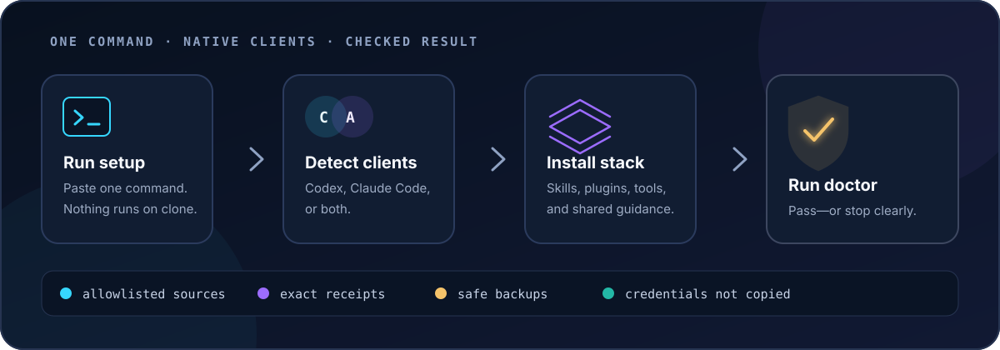

<div align="center">
  
  <p><strong>Share your AI-agent setup like a product.</strong></p>
  <p>Agent Toolkit turns reusable skills, plugins, tools, and guidance into one portable setup for <strong>Codex</strong>, <strong>Claude Code</strong>, or both—without transferring credentials or private workspace data between clients.</p>
  <p>
    <a href="#install"><strong>Install</strong></a>
    · <a href="#what-you-get">Explore the stack</a>
    · <a href="#trust-by-design">Security model</a>
    · <a href="#documentation">Documentation</a>
  </p>
  <p>
    <a href="https://github.com/udhawan97/agent-toolkit/actions/workflows/validate.yml"></a>
    
    
    <a href="LICENSE"></a>
  </p>
</div>

> **In plain English:** skills are reusable playbooks for an AI coding agent; plugins and MCP servers give it extra capabilities. This repository installs a reviewed collection of both and keeps the setup understandable, updateable, and removable.

## Install

Run one command. The first launcher run installs the toolkit; later runs update it. The launcher finishes every successful install or update with a health check.

**macOS or Linux**

```bash
curl -fsSL https://raw.githubusercontent.com/udhawan97/agent-toolkit/stable/bin/setup | sh
```

**Windows PowerShell**

```powershell
irm https://raw.githubusercontent.com/udhawan97/agent-toolkit/stable/bin/setup.ps1 | iex
```

> [!WARNING]
> These commands execute the current, mutable `stable` branch and can install missing Git or Python through a supported system package manager. Use the inspection path below if you want to review the exact checkout and dry-run the installer first.

> [!IMPORTANT]
> Install [Codex CLI](https://developers.openai.com/codex/cli/) or [Claude Code](https://docs.anthropic.com/en/docs/claude-code/overview) first. Agent Toolkit detects either client—or both—and installs only the matching integrations. Restart active client sessions when setup finishes.

<picture>
  <source media="(max-width: 600px)" srcset="assets/diagrams/setup-overview-mobile.svg">
  
</picture>

<details>
<summary><strong>What can the launcher change?</strong></summary>

The launcher can install missing Git and Python 3.10+ through a supported package manager, then creates an isolated Python environment for Graphify. It does **not** require Node.js, `npx`, `uv`, or `pipx`.

On macOS, automatic prerequisite installation requires Homebrew. On Linux it supports `apt`, `dnf`, `pacman`, `apk`, or `zypper`; on Windows it supports `winget`. If no supported manager is available, setup stops and explains what to install manually. Set `AGENT_KIT_AUTO_PREREQS=0` to manage system packages yourself.

</details>

<details>
<summary><strong>Prefer to inspect it before running?</strong></summary>

```bash
git clone --branch stable --depth 1 https://github.com/udhawan97/agent-toolkit.git
cd agent-toolkit
python3 bin/agent-kit validate
python3 bin/agent-kit install --source local --dry-run
python3 bin/agent-kit install --source local
python3 bin/agent-kit doctor
```

Nothing runs merely because you clone or download the repository. A [stable ZIP](https://github.com/udhawan97/agent-toolkit/archive/refs/heads/stable.zip) is also available for manual installation. To inspect the unreleased candidate described here, clone `main` instead of `stable` and run the same validation and local-source dry-run commands before installing.

```bash
# Execute the mutable main candidate through its remote launcher, not stable
AGENT_KIT_CHANNEL=main sh -c "$(curl -fsSL https://raw.githubusercontent.com/udhawan97/agent-toolkit/main/bin/setup)" -- install --clients both
```

</details>

> [!NOTE]
> This README follows the unreleased 0.3.0 candidate on `main`. The one-line launchers intentionally use the reviewed `stable` channel and will pick up these changes only after promotion. A previous macOS core lifecycle covered 14 owned workflows; the current 15-workflow candidate and its `recommended` profile still need a fresh clean install/update/doctor run. Linux and Windows run repository and launcher checks in CI; native client lifecycle validation on those platforms is still pending.

## Why it exists

| The problem | The approach | The proof |
| --- | --- | --- |
| Agent setups drift between machines and clients. | One reviewed manifest targets Codex, Claude Code, or both. | `doctor` checks the installed result instead of assuming success. |
| Updating tools by hand is slow and inconsistent. | The same command installs today and refreshes later; optional scheduled updates require explicit opt-in. | Receipts record each tracked skill source's exact commit and installed inventory, plus the toolkit's source, profile, ownership, and policy choices. |
| Sharing dotfiles can leak private context. | Only explicit, sanitized templates and allowlisted packages are distributed. | Validation checks macOS, Linux, and Windows home paths, credential-bearing URLs, local documentation links, Git author metadata, and manifest-to-payload drift. |

## What you get

The default `recommended` profile installs the complete public-safe stack.

### Original workflows

The plugin contains all 15 toolkit-owned skills. Eight work across projects; seven preserve the contracts of public products and release paths. Review and audit remain distinct from implementation, publishing, and deployment.

| Everyday workflow | What it helps you do |
| --- | --- |
| ⚖️ `council-review` | Challenge important results through a two-round evidence review. |
| 🧑‍💻 `dev-review` | Run a friendly senior production review with three specialist developers, a scored offline report, and approval-gated fixes. |
| 🧩 `improve-userflow-design` | Audit an end-to-end journey, then improve only the gaps you select. |
| 🧪 `localtesting` | Build, install, verify, and safely preview duplicate local artifacts. |
| 🔁 `loop-refine-release` | Run an explicitly requested implementation-to-local-merge refinement loop. |
| 🧹 `main-cleanup` | Reconcile branches and worktrees without losing unique or uncommitted work. |
| 📚 `refresh-docs` | Bring a README, website, visuals, and download story in sync with the product. |
| 🧭 `tech-debt` | Connect architecture or stack debt to a real user consequence. |

<details>
<summary><strong>Seven public product and release guardrails</strong></summary>

| Guardrail | Protects |
| --- | --- |
| 💹 `folioorb-financial-integrity` | Financial data, portfolio metrics, persistence, updates, and releases. |
| 🎯 `golavo-product-trust` | Forecast evidence, local models, data packs, packaging, and releases. |
| 🗂️ `orifold-workflow` | Orifold product, implementation, packaging, cleanup, and release rules. |
| 🚀 `releasegit` | A verified Orifold GitHub release from tests through public assets. |
| ✅ `releasetesting` | Production-readiness evidence for the installed Orifold app. |
| 🔎 `shipped-product-verification` | The real installed, downloaded, or deployed surface—not source alone. |
| 🧳 `voyalier-product-contract` | Voyalier privacy, accessibility, pack, desktop, and release boundaries. |

</details>

The reviewed [`catalog/personal-skills.json`](catalog/personal-skills.json) manifest must match the shipped plugin exactly. Private, account-bound, duplicate, and third-party skills stay out of the **owned** plugin. Approved third-party skills such as Hallmark stay attributed to their creators and are installed from the upstream allowlist instead. A public product-specific skill is included only when it is self-contained and free of personal paths or data.

### Curated technical stack

Third-party packages come from their original repositories or official marketplaces; they are linked, verified, and recorded rather than silently republished here.

| Job | Included |
| --- | --- |
| 🗺️ Understand a codebase | Graphify and Understand Anything |
| 🛠️ Plan and deliver | Every skill currently published on Matt Pocock's upstream `main`, with the resolved commit and inventory recorded locally |
| 🎨 Design distinctive interfaces | Hallmark from Nutlope/Together AI, kept third-party and commit-receipted |
| ⚛️ Engineer frontend systems | Vercel's React performance, composition-pattern, and web-interface review skills |
| 📐 Explain systems | Diagram Design |
| ✂️ Keep implementations simple | Ponytail |
| 🌐 Work with the browser | Obscura MCP with pinned payload and exact registration checks |
| 🧱 Extend Codex | Essential OpenAI app-building, visualization, security, and developer plugins |
| 🧠 Extend Claude Code | Anthropic-authored setup, review, simplification, feature, design, security, and skill-authoring workflows, plus attributed partner packages |
| 📜 Align both clients | Sanitized [Codex `AGENTS.md`](templates/codex/AGENTS.md) and [Claude `CLAUDE.md`](templates/claude/CLAUDE.md) guidance blocks |

Every external source, license, package, and update rule is listed in the [upstream source ledger](docs/UPSTREAMS.md).

Hallmark is the opinionated anti-template layer; Vercel's skills cover performance, component architecture, accessibility, and interface review. Anthropic's `frontend-design` remains part of the Claude provider bundle. Account-connected tools stay outside the default allowlist because they require user-specific connections and permissions.

## Choose your setup

Most people can keep the default. Profiles are available when you want a smaller surface.

| Profile | Best for | Installs |
| --- | --- | --- |
| `recommended` | Most users | The complete public-safe stack above |
| `skills-only` | No provider plugins or MCP | Original workflows, Graphify, Matt Pocock's skills, Hallmark, Vercel's frontend set, and shared guidance |
| `full` | Automation that wants an explicit “everything” name | An alias of the same complete allowlist as `recommended` |

For a minimal owned-workflow install, add `--core-only`. Add `--no-guidance` when you also want to leave existing global guidance untouched.

<details>
<summary><strong>Client and profile examples</strong></summary>

```bash
python3 bin/agent-kit install --clients codex
python3 bin/agent-kit install --clients claude --profile skills-only
python3 bin/agent-kit install --clients both --core-only --no-guidance
```

</details>

## Trust by design

This is an installer, so its safety model is part of the product—not a footnote.

| Principle | How Agent Toolkit applies it |
| --- | --- |
| **Explicit action** | Downloading or cloning does nothing. Setup begins only when you run it. |
| **Allowlisted sources** | External packages must appear in the reviewed catalog and are fetched from their named providers. |
| **Verifiable payloads** | Matt Pocock, Hallmark, and Vercel skill sources record exact commits; Obscura verifies its archive, executable, worker, and MCP command. |
| **Safe ownership** | Receipts track plugin and marketplace ownership plus upstream managed targets. Unmanaged conflicts fail closed; changed skill trees adopted for management are backed up before replacement. |
| **Private by default** | Setup does not transfer credentials or authentication state between clients or publish private context. Existing guidance may be preserved in private local backups when setup changes it. |
| **Observable result** | `doctor` checks repository integrity, clients, plugins, skills, tools, enabled state, and MCP registration. |

Mutable upstream branches still require trust when you update, and provider authentication remains a separate provider-controlled step. Read the full [security and privacy model](SECURITY.md) before using the installer in a sensitive environment.

## Try a workflow

Restart the client after installation, then ask for one of the toolkit-owned workflows.

**Codex**

```text
Use $dev-review to audit this repository for production readiness. Audit only.
```

```text
Use $tech-debt to audit how this stack affects the checkout journey. Audit only.
```

**Claude Code**

```text
/evidence-workflows:dev-review Audit this repository for production readiness. Audit only.
```

```text
/evidence-workflows:tech-debt Audit how this stack affects the checkout journey. Audit only.
```

## Keep it current

| Command | Result |
| --- | --- |
| Rerun the install command | Refreshes an existing install, adds a newly detected second client, and runs `doctor` |
| `update` | Explicitly refreshes the toolkit, receipted workflows, tracked skill sources, and native marketplaces |
| `auto-update enable` | Opts into a user-level daily or weekly schedule; never enabled during normal setup |
| `auto-update status` / `run` / `disable` | Shows the schedule, runs the configured update now, or removes it without uninstalling anything |
| `doctor` | Runs health checks; the one-line launcher may refresh prerequisites and its managed checkout first |
| `uninstall` | Removes receipt-owned Agent Toolkit plugins and, optionally, its guidance block |

```bash
# Update
curl -fsSL https://raw.githubusercontent.com/udhawan97/agent-toolkit/stable/bin/setup | sh -s -- update

# Verify
curl -fsSL https://raw.githubusercontent.com/udhawan97/agent-toolkit/stable/bin/setup | sh -s -- doctor

# Optional: allow weekly automatic updates
curl -fsSL https://raw.githubusercontent.com/udhawan97/agent-toolkit/stable/bin/setup | sh -s -- auto-update enable --frequency weekly

# Optional: run the configured update now
curl -fsSL https://raw.githubusercontent.com/udhawan97/agent-toolkit/stable/bin/setup | sh -s -- auto-update run

# Disable automatic updates
curl -fsSL https://raw.githubusercontent.com/udhawan97/agent-toolkit/stable/bin/setup | sh -s -- auto-update disable

# Remove the toolkit-owned layer
curl -fsSL https://raw.githubusercontent.com/udhawan97/agent-toolkit/stable/bin/setup | sh -s -- uninstall --remove-guidance
```

> [!WARNING]
> Each command above reruns the launcher. It may install missing Git/Python and fast-forward the managed checkout to the current `stable` branch before it performs the requested action. For inspection-first maintenance, enter a reviewed local checkout and run `python3 bin/agent-kit doctor` or `python3 bin/agent-kit uninstall` directly.

Automatic updates are deliberately opt-in because they accept new code from the mutable GitHub channel recorded in the receipt (`stable` or `main`) and allowlisted upstream branches. They require an existing GitHub installation receipt; first installs and local checkouts remain manual. They run as the current user through launchd, a systemd user timer, or Windows Task Scheduler; scheduled runs set `AGENT_KIT_AUTO_PREREQS=0`, so they never install system prerequisites, and write their configuration and log under `.agent-toolkit/auto-update/`. A receipt records the selected source and resolved inputs for comparison, but does not make mutable upstream code an immutable release. Repository tests cover schedule configuration and command generation; native scheduler activation and the recommended-profile lifecycle remain separate verification gates. Disabling the schedule removes future runs but does not roll back an update already applied. If an unmanaged Hallmark or Vercel skill already exists, use `install --adopt-existing` for a first install or `update --adopt-existing` when adding it to an existing receipt; the copy is preserved before replacement, and later updates compare against the ownership receipt.

Third-party packages remain owned by their original package managers, so uninstall does not mass-delete tools another setup may also use. PowerShell supports the same arguments; see [Getting started](docs/GETTING_STARTED.md) for copy-paste Windows examples.

## Engineering decisions

Agent Toolkit is intentionally more structured than a dotfiles bundle:

- **Provider-neutral core:** original workflows use a shared skill format, while thin adapters expose them through each client's native paths.
- **Idempotent lifecycle:** install and update reconcile the desired state; receipts make repeated runs and removal predictable.
- **Supply-chain visibility:** allowlists, checksums, source URLs, exact commits where available, and inventories make external inputs inspectable.
- **Fail-closed changes:** ambiguous ownership, malformed payloads, or stale verification stop the operation instead of guessing.
- **Testable boundaries:** repository validation, launcher checks, disposable native-client tests, and public-surface scans exercise different risk layers.


<details>
<summary><strong>Developer validation</strong></summary>

```bash
python3 bin/agent-kit validate --native
python3 -m unittest discover -s tests -v
sh -n bin/setup
```

Maintainers should read [Maintaining](docs/MAINTAINING.md) before changing manifests, profiles, bootstrap behavior, or bundled skills.

</details>

## Compatibility

| Surface | Current verification boundary |
| --- | --- |
| macOS | Prior 0.3 core-profile dual-client lifecycle verified on the 14-workflow tree; current 15-workflow rerun pending |
| Linux | Repository and launcher CI verified; native upstream lifecycle pending |
| Windows | Repository and PowerShell launcher CI verified; native upstream lifecycle pending |

The `main` branch documents the unreleased 0.3.0 integration candidate. `stable` is the reviewed preview-install channel and may lag until promotion; no immutable `v*` release is claimed here. Exact client versions and the latest validation date live in [Compatibility](COMPATIBILITY.md).

## Documentation

| Guide | Use it when… |
| --- | --- |
| [Getting started](docs/GETTING_STARTED.md) | You want alternate clients, profiles, or Windows commands. |
| [Upstream source ledger](docs/UPSTREAMS.md) | You want to inspect every external source and update rule. |
| [Troubleshooting](docs/TROUBLESHOOTING.md) | A dependency, marketplace, plugin, Graphify, or MCP check stops setup. |
| [Testing](docs/TESTING.md) | You are verifying a disposable install or public candidate. |
| [Maintaining](docs/MAINTAINING.md) | You are changing the catalog, installer, or stable channel. |

---

<div align="center">
  <sub><strong>Portable where it should be. Native where it matters. Private by default.</strong></sub>
</div>
